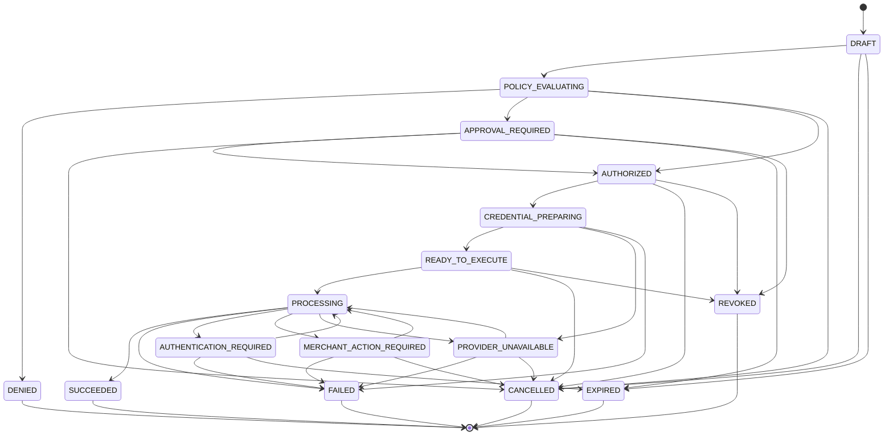

# AgenticPaymentIntent

`internal/domain/paymentintent.AgenticPaymentIntent` is what a tenant's agent creates to request a single agentic payment — the core primitive of the B2B product. See `docs/B2B_INTEGRATION.md` for the integration guide and `ARCHITECTURE.md` for how this fits into the whole system.

## Why this isn't `PurchaseIntent`

`internal/domain/intent.PurchaseIntent` (Algebra's original, commerce-flow primitive) is discovery-shaped: items, merchant search, quotes, a `SelectedQuoteID`. That's right for the consumer reference app's "find me headphones under ₹3,000" flow. A tenant's agent usually already knows the merchant and amount — "spend $73 at this specific merchant" — with no discovery step at all. Forcing that through a discovery-shaped state machine would be a worse fit than a purpose-built object.

What *is* shared is the pattern: `internal/domain/intent/state.go` + `state_machine.go` is the most rigorously-enforced state machine in the codebase — a single transition-table allow-list, one enforcement function (`Transition`), one call path (`internal/app`'s `transitionIntent`). `AgenticPaymentIntent`'s state machine (`internal/domain/paymentintent/state.go` + `state_machine.go`) copies that pattern exactly, enforced through the parallel `transitionPaymentIntent` helper (`internal/app/payment_intent_transition.go`).

## State machine

`POLICY_EVALUATING -> AUTHORIZED` directly (skipping `APPROVAL_REQUIRED`) is policy `ALLOW` — auto-authorized, no human in the loop, same as `PurchaseIntent`'s `POLICY_CHECK -> APPROVED` direct edge. `DENIED` is terminal: nothing — not the agent, not a human, not this code — can override a policy denial after the fact; a new intent is required.

## Approval reuse, not reinvention

`internal/domain/approval.Approval` (built for the commerce flow) is reused rather than duplicated. A nullable `agentic_payment_intent_id` column sits alongside the existing `intent_id` — exactly one is set per row. This keeps `CanonicalHash`/`Matches`/expiry, and — most importantly — the DB-level compare-and-swap on `APPROVED -> CONSUMED` (`internal/platform/postgres/approval_repo.go`'s `MarkConsumed`), which is the actual double-execution guard in the system. For a payment intent, `ItemsHash` is computed over an empty item list (there's no cart) — still binding merchant + currency + payment-source alias; `QuoteID` is left empty.

There is deliberately no `approve`/`reject` tool exposed to an agent (REST or MCP) — approval is always a human action taken in the tenant's own console via `POST /api/v1/payment-intents/{id}/approve`, the same safety boundary `commerce.approve_purchase` already carries for the consumer flow.

## Field reference

| Field | Notes |
|---|---|
| `tenant_id` | The business that owns this — see `internal/domain/tenant`. |
| `user_id` / `agent_id` | The tenant's end user this spend is on behalf of, and the requesting agent. |
| `purpose` | Free-text, agent-supplied — audit/UI context only, **never** read by policy. |
| `merchant` / `merchant_domain` | What policy evaluates against (`allowed_merchants`/`blocked_merchants`). |
| `category` / `international` | Same policy dimensions `PurchaseIntent.Constraints` already has. |
| `amount_minor_units` / `currency` / `tolerance_minor_units` | Integer minor units, no floats — same convention as every other money field in the codebase. |
| `payment_source_alias` | A reference into `internal/domain/payment.PaymentSource` — never the credential itself. |
| `policy_version` | Which `PolicySet` version evaluated this — see `docs/B2B_INTEGRATION.md`'s policy section. |
| `provider_transaction_id` / `provider_status` / `final_amount_minor_units` / `final_currency` | Populated only after execution, from what the provider actually confirmed — never fabricated locally. |

No field on this struct can hold a raw payment credential — there is no such field to begin with, the same non-custodial guarantee `internal/domain/payment.PaymentSource`'s package doc already states.
