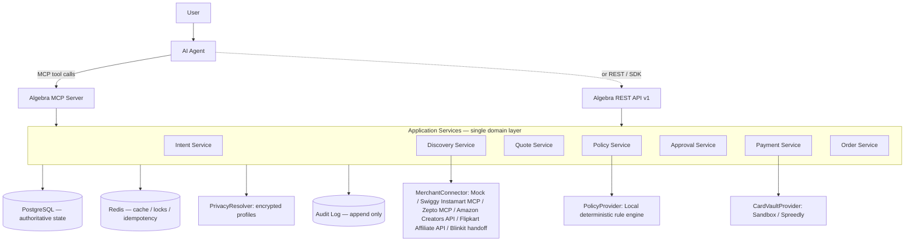
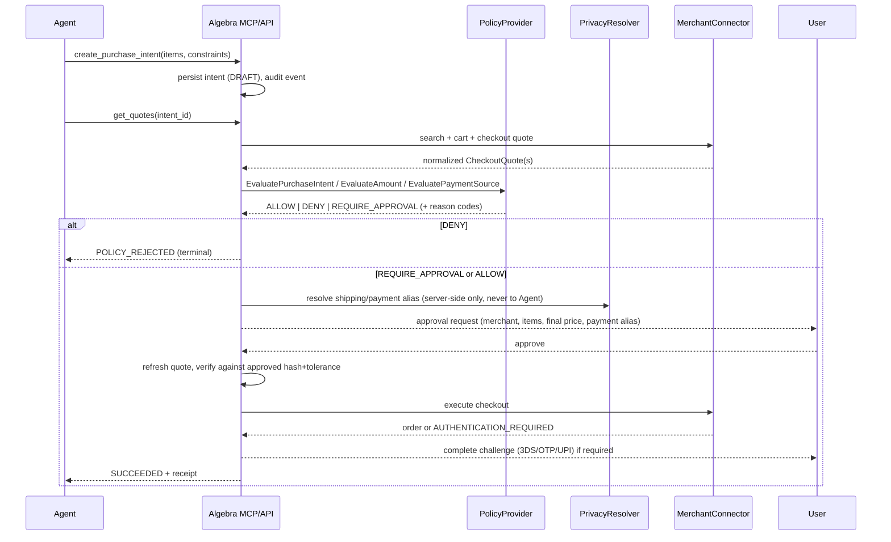
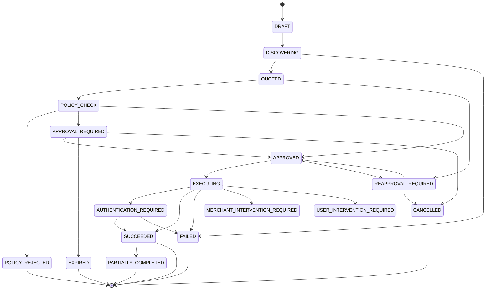

# Architecture

Project Algebra is an agentic-commerce **control plane**: it turns a user instruction into a structured `PurchaseIntent`, then safely orchestrates discovery, policy, privacy, payment, and merchant execution around it. It never gives an AI model unrestricted access to money — agents get scoped capabilities and aliases, never secrets.

## 1. System context



MCP, REST, and the future TypeScript SDK are **thin transports**. They parse a request, call an application service in `internal/app`, and serialize the result. No commerce logic is duplicated across transports — this is a hard rule (mandate §53), not a style preference, because divergent logic between "what the agent can do" and "what the API can do" is itself a security bug.

## 2. Purchase flow



The agent never sees the resolved shipping address, card details, or OTP at any point in this sequence — it sees intent IDs, quote IDs, approval IDs, and final states.

## 3. State machine

`internal/domain/intent` implements the mandate's states as a server-validated transition table (`state_machine.go`). Every transition is checked against an explicit allow-list; an illegal transition returns an error and nothing is persisted. Every successful transition emits an `AuditEvent`.



## 4. Why Go / Python / TypeScript

- **Go** (this build): everything on the money/authorization path — API gateway, MCP server, intent/policy/approval/payment/order services, audit. Latency-sensitive, needs strong typing and no GIL for concurrent merchant fan-out.
- **Python** (interfaces designed, not built in Phase 1): product discovery, catalog normalization, coupon/offer parsing, ranking. Explicitly **not** the authorization authority — a Python worker can propose a normalized product/offer, it cannot approve a payment.
- **TypeScript** (interfaces designed, not built in Phase 1): Next.js console, browser extension, SDK. Calls the same REST/MCP surface as any other client — no special back-door.

## 5. Module boundaries (Go modular monolith)

```
internal/domain     entities + interfaces, zero I/O, fully unit-testable
internal/app        application services — the ONE place business rules live
internal/platform   postgres, redis, config, logging/redaction
internal/api/v1     REST transport (thin)
internal/mcpserver  MCP transport (thin)
connectors/*        MerchantConnector implementations; connectors/remotemcp is the shared OAuth + MCP client for remote-MCP merchants
providers/*         CardVaultProvider / ConfidentialComputeProvider implementations
```

`internal/app` depends on `internal/domain` interfaces, never on concrete connectors/providers directly — those are injected at `cmd/api` / `cmd/mcp` startup. This is what makes "split into services later" realistic: the seam is already an interface boundary, not a package-private function call.

## 6. Deployment shape (target — see [GCP_DEPLOYMENT.md](GCP_DEPLOYMENT.md))

Go API/MCP → Cloud Run. Postgres → Cloud SQL. Redis → Memorystore. Async events → Pub/Sub. Secrets → Secret Manager. Envelope-encryption keys → Cloud KMS. Nothing in this repo deploys itself yet; this is the target mapping, not a claim of an existing deployment.
